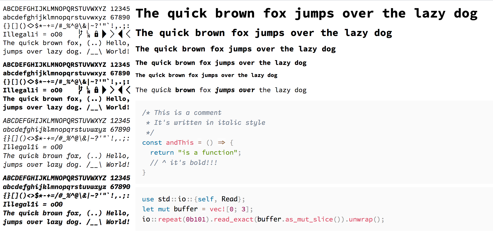

# Haskplex = Hasklig + IBM Plex Mono

This repository contains the combined version of **Hasklig** (bold + regular style) and **IBM Plex Mono** (italic + bold italic style) fonts. The font family has been renamed into **Haskplex**.



**Installation:**

```
$ brew tap huytd/cask-fonts

# Install Haskplex font
$ brew cask install font-haskplex

# Install Haskplex Nerd font
$ brew cask install font-haskplex-nerd
```

If you want icons, use **Haskplex Nerd**, the font is much more bigger because it was bundled with a lot of icons:


**Disclaimer:** I do not own any of the two fonts. All the work are done by the team behind both [Hasklig](https://github.com/i-tu/Hasklig) and [IBM Plex Mono](https://github.com/IBM/plex) font.
